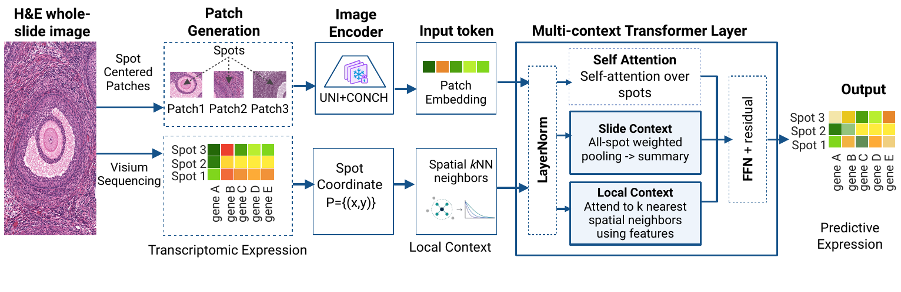
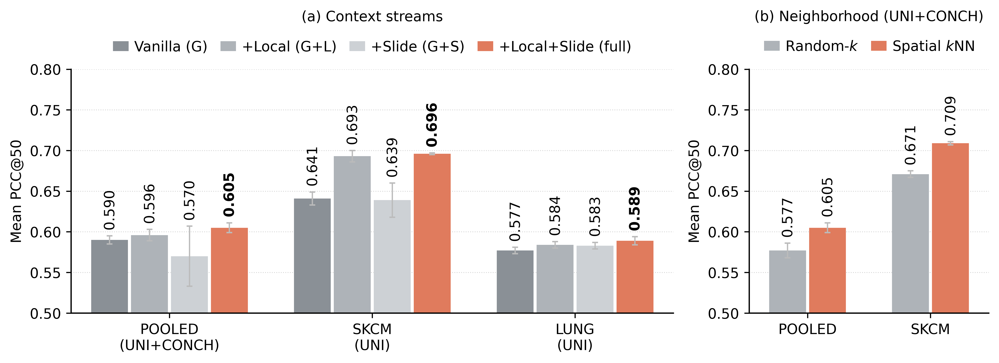
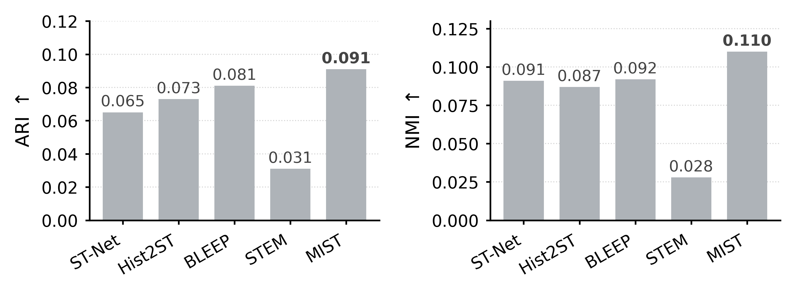
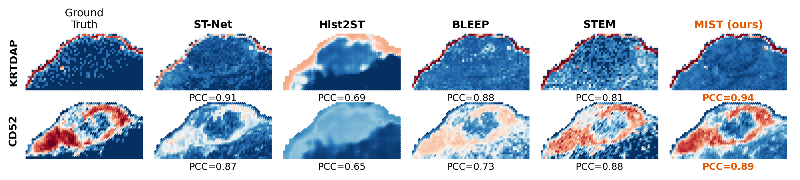
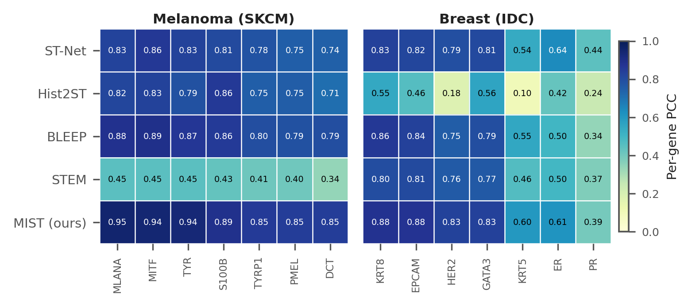
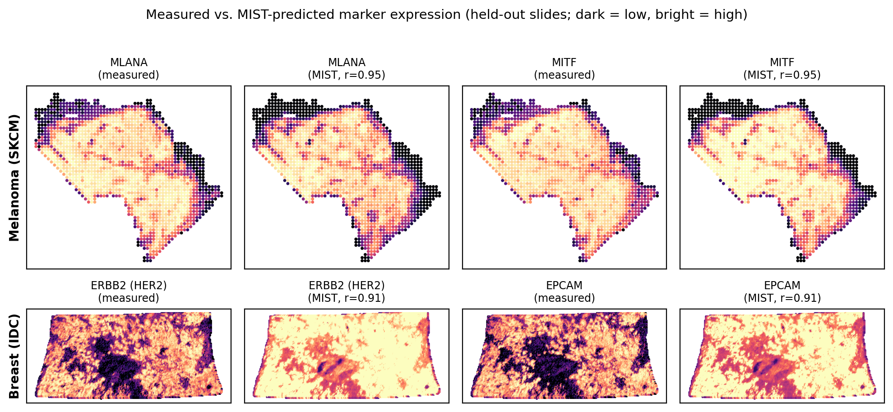

<h1 align="center">MIST: Multi-Scale Spatial Context for Gene Expression Prediction from Histology</h1>

<p align="center">
  <b>A MultI-context Spatial Transformer that predicts spatial gene expression from H&amp;E histology.</b><br>
  Self-attention backbone + a coordinate-invariant <i>local</i> pathway + a <i>slide</i> pathway, applied in every layer.
</p>

<p align="center">
  
</p>

---

## Abstract

Predicting spatial gene expression from standard H&E images could extend molecular analysis to
tissues without spatial transcriptomic measurements. A standard Transformer applies self-attention
over spots but ignores *where* each spot sits in the tissue, whereas a spot's molecular state
depends on tissue context at multiple spatial scales. Building on this insight, we introduce
**MIST**, a **M**ult**I**-context **S**patial **T**ransformer that augments the self-attention
backbone with two context pathways applied in every layer: a coordinate-invariant **local** pathway
that attends over spatial *k*-nearest-neighbor spots, and a **slide** pathway that broadcasts a
whole-slide summary to every spot; the model predicts all spots in a single forward pass. Because
coordinates enter only through pairwise distances, the local pathway is invariant to translations,
rotations, and reflections when image features are fixed. In intra-cohort evaluation across six
human organ cohorts from HEST-1k, MIST improves mean Pearson correlation over the strongest
evaluated baseline by 9.7%, 11.6%, and 11.4% for 10-, 50-, and 100-gene panels, respectively, with
the lowest average MSE and MAE. MIST further improves leave-one-organ-out transfer by 6.0% over the
next strongest baseline, attains the best expression-derived domain recovery, and reproduces spatial
expression patterns of selected cancer-marker genes.

## Highlights

- 🏆 **Best on every organ.** Highest mean PCC on all six HEST-1k cohorts; **+9.7% / +11.6% / +11.4%** over the strongest baseline at 10- / 50- / 100-gene panels, with the lowest MSE and MAE.
- 🌍 **Generalizes to unseen organs.** Leave-one-organ-out transfer **+6.0%** over BLEEP (0.422 vs 0.398), matching or beating it on all six held-out organs (Wilcoxon *p* = 0.018).
- 🧭 **Coordinate-invariant by construction.** ΔPCC ≈ 10⁻⁴ under translation, rotation, reflection, and spot permutation (image features fixed).
- 🗺️ **Preserves spatial structure.** Best expression-derived domain recovery (ARI 0.091 / NMI 0.110); higher NMI than BLEEP on **84%** of held-out slides.
- 🔬 **Biologically faithful.** Recovers melanoma markers (mean PCC **0.895**, MLANA 0.949) and breast-cancer receptor markers (mean **0.717**, HER2 0.829); predicted spatial maps match measured tumor layout (*r* ≥ 0.91).
- 📈 **Statistically robust.** +0.051 PCC@50 over BLEEP (95% CI [0.041, 0.062], Wilcoxon *p* = 7.6×10⁻⁶); higher gene-level PCC on 87% of 300 evaluated genes.

## Method

MIST is a stack of identical layers over the spots of one slide. Each layer runs three context
streams and fuses them:

1. **Self-attention (backbone)** — global attention over all spots; permutation-equivariant but spatially agnostic.
2. **Local pathway** — content-based attention restricted to each spot's spatial *k*-nearest neighbors. Coordinates enter **only** through pairwise distances, making this pathway invariant to translation, rotation, and reflection of the coordinate frame.
3. **Slide pathway** — an attention-pooled whole-slide summary broadcast back to every spot.

The model predicts all spots of a slide in a single forward pass from **frozen** patch features
(e.g. UNI / CONCH) plus spot coordinates.

---

## Results

### Intra-cohort — mean PCC across six organs (50-gene panels)

Six-cohort average PCC (↑); best per panel in **bold**. Per-cohort numbers and ± SD over three seeds are in the paper.

| Model    | HVG       | DEG       | HMHVG     |
|----------|-----------|-----------|-----------|
| ST-Net   | 0.425     | 0.528     | 0.558     |
| Hist2ST  | 0.335     | 0.475     | 0.524     |
| BLEEP    | 0.444     | 0.559     | 0.587     |
| STEM     | 0.310     | 0.443     | 0.478     |
| **MIST** | **0.496** | **0.615** | **0.650** |

### Cross-organ transfer — Leave-One-Organ-Out (PCC ↑, mean over 3 seeds)

Each fold withholds one organ from training and tests only on it. MIST is best on every held-out organ.

| Model    | IDC       | CCRCC     | LUNG      | PAAD      | PRAD      | SKCM      | **Avg.**  |
|----------|-----------|-----------|-----------|-----------|-----------|-----------|-----------|
| ST-Net   | 0.332     | 0.074     | 0.535     | 0.382     | 0.078     | 0.500     | 0.317     |
| Hist2ST  | 0.350     | 0.064     | 0.581     | 0.214     | 0.062     | 0.694     | 0.328     |
| BLEEP    | 0.401     | 0.058     | 0.630     | 0.497     | 0.091     | 0.708     | 0.398     |
| STEM     | 0.353     | 0.055     | 0.543     | 0.393     | 0.041     | 0.492     | 0.313     |
| **MIST** | **0.425** | **0.098** | **0.687** | **0.499** | **0.105** | **0.720** | **0.422** |

### Pooled multi-organ (one model, six organs, PCC ↑)

| ST-Net | Hist2ST | BLEEP | STEM | **MIST** |
|:------:|:-------:|:-----:|:----:|:--------:|
| 0.351  | 0.556   | 0.587 | 0.273| **0.599**|

## Ablation — what each context stream contributes

<p align="center"></p>

Starting from the self-attention backbone: **local** context alone helps (+0.016, *p* = 0.02),
adding **both** pathways is best in every setting (+0.024, *p* = 3.4×10⁻⁴). The pathways are
complementary — slide context does not help alone (−0.010) but adds +0.007 on top of local. The
local pathway needs **spatially defined** neighbors: replacing kNN with random neighbors of the same
size costs **0.031 PCC** (*p* = 8.4×10⁻⁵).

## Spatial structure preservation

<p align="center"></p>

Clustering spots into domains (KMeans, *k* = 6) separately from predicted and measured expression,
MIST achieves the highest agreement (ARI **0.091**, NMI **0.110** vs BLEEP 0.081 / 0.092), and wins
on **84%** of held-out slides by NMI (*n* = 58, *p* = 1.5×10⁻⁸). The ordering holds for *k* ∈ {4, 6, 8, 10}.

<p align="center"></p>

## Biological validation — recovering cancer markers

<p align="center">
  
  
</p>

MIST recovers canonical melanoma markers (mean PCC **0.895**; MLANA 0.949) and breast-cancer
receptor markers (mean **0.717**; HER2 0.829), obtaining the top average correlation for both
cancers. Its predicted spatial maps closely match the measured tumor layout (*r* ≥ 0.91).

---

# Getting started

## 1. Installation

```bash
python -m venv .venv && source .venv/bin/activate     # or conda
pip install -r requirements.txt
```

Tested with Python 3.10+ and PyTorch 2.x on a CUDA GPU (CPU works but is slow).

The code is **self-contained**: `stflow_utils.py` vendors the only external IO helpers
needed (HDF5 / AnnData readers), so no additional project packages are required.

## 2. Expected data layout

MIST consumes frozen patch embeddings, log-normalized expression, split CSVs, and gene
panels, resolved by convention (not config):

```
<embed_dataroot>/<COHORT>/<feature_encoder>/fp32/<sample_id>.h5     # spot features + coords + barcodes
<source_dataroot>/<COHORT>/adata/<sample_id>.h5ad                   # expression (AnnData)
<source_dataroot>/<COHORT>/<gene_list>.json                        # e.g. var_50genes.json -> {"genes": [...]}
<source_dataroot>/<COHORT>/splits/train_<i>.csv, test_<i>.csv      # intra-cohort folds
```

- Each `.h5` holds `embeddings`, `coords`, and `barcode` datasets for the spots of one slide.
- Split CSVs have columns `sample_id, patches_path, expr_path`; fold count is inferred as
  `len(splits)//2`.
- Gene-panel JSON is `{"genes": [...]}`. Common panels: `var_10genes`, `var_50genes` (HVG),
  `deg_50genes`, `hmhvg_50genes`, `var_100genes`, `var_200genes`.
- For cross-organ runs, a `splits_root/<REGIME>/` directory holds `train_<fold>.csv`,
  `test_<fold>.csv`, and `genes_<fold>.json` (leakage-safe per-fold panels).

Features are dataset-agnostic; the pipeline follows the public
[HEST-1k](https://huggingface.co/datasets/MahmoodLab/hest) benchmark conventions. Extract
patch features (e.g. with frozen UNI and/or CONCH encoders) into the layout above before
training.

## 3. Quick start — demo dataset

A tiny **real** dataset ships in `demo_data/` (a spatial crop of two HEST-1k CCRCC slides,
400 spots each, UNI features, 50-gene panel) so you can verify the pipeline end-to-end in
seconds — no downloads, CPU is fine:

```bash
python train_hest.py \
  --cohort DEMO --version V3 --feature_encoder uni_v1_official \
  --source_dataroot demo_data/source \
  --embed_dataroot  demo_data/embed \
  --save_root results_demo --seed 1 --device cpu --epochs 5
```

This trains full MIST on `INT1` and tests on `INT5`, writing metrics/predictions under
`results_demo/DEMO_V3_seed1/`. The demo is a smoke test, not a benchmark — with 400 spots
and 5 epochs the PCC is not meaningful; use the full HEST data for real numbers.
`demo_data/make_demo_data.py` documents exactly how the subset was built.

## 4. Training

### Intra-cohort (`train_hest.py`)
Train and test within one cohort, over its k-fold splits.

```bash
python train_hest.py \
  --cohort SKCM --version V3 \
  --feature_encoder uni_conch \
  --gene_list var_50genes.json \
  --source_dataroot /path/to/dataset \
  --embed_dataroot  /path/to/embed_dataroot \
  --save_root results_intra --seed 1
```

### Cross-organ (`train.py`) — pooled or leave-one-organ-out
```bash
# Pooled multi-organ (held-out slides)
python train.py --regime POOLED --version V3 --components 111 \
  --feature_encoder uni_conch \
  --splits_root /path/to/cross_organ_splits \
  --source_dataroot /path/to/dataset \
  --embed_dataroot  /path/to/embed_dataroot \
  --save_root results_pooled --seed 1

# Leave-one-organ-out (train on all but one organ, test on the held-out organ)
python train.py --regime LOOO --version V3 --components 111 \
  --feature_encoder uni_conch \
  --splits_root /path/to/cross_organ_splits \
  --source_dataroot /path/to/dataset \
  --embed_dataroot  /path/to/embed_dataroot \
  --save_root results_looo --seed 1
```

**Full MIST** uses `--version V3` (equivalently `--components 111`, the L/G/S bit mask
`[Local, Global, Slide]`). Reported models use `--dim 256 --n_layers 4 --n_heads 4 --k 8
--num_rbf 16 --lr 1e-3 --weight_decay 0.01 --epochs 100 --patience 20 --corr_weight 0.5`,
averaged over seeds 1, 2, 3.

## 5. Ablations

`mist_context.py` exposes the full **L/G/S factorial** and the neighborhood control,
driven by `--config` in the context trainers (`train_context.py`,
`train_context_pooled.py`):

| `--config`      | Local | Global | Slide | Neighbors    |
|-----------------|:-----:|:------:|:-----:|--------------|
| `global`        |       |   ✓    |       | —            |
| `local`         |   ✓   |        |       | spatial kNN  |
| `slide`         |       |        |   ✓   | —            |
| `global_local`  |   ✓   |   ✓    |       | spatial kNN  |
| `global_slide`  |       |   ✓    |   ✓   | —            |
| `local_slide`   |   ✓   |        |   ✓   | spatial kNN  |
| `full`          |   ✓   |   ✓    |   ✓   | spatial kNN  |
| `global_random` |   ✓   |   ✓    |       | **random-k** |
| `full_random`   |   ✓   |   ✓    |   ✓   | **random-k** |

```bash
python train_context_pooled.py --regime POOLED --config full --seed 1 \
  --feature_encoder uni_conch \
  --splits_root /path/to/cross_organ_splits \
  --source_dataroot /path/to/dataset --embed_dataroot /path/to/embed_dataroot \
  --save_root results_ablation
```

The `full` vs `full_random` comparison isolates the value of **spatially defined**
neighborhoods; the single-stream configs isolate each pathway's contribution.

Equivalently, `train_hest.py --components <LGS>` runs the same factorial intra-cohort
(e.g. `--components 010` = global-only backbone, `--components 111` = full model).

## 6. Baselines

The four feature-matched baselines MIST is compared against (**ST-Net, Hist2ST, BLEEP, STEM**)
live in `baselines/`. Each consumes the same features, splits, panels, and metric as MIST; only the
spatial-modeling core differs. See [`baselines/README.md`](baselines/README.md) for reproduction
commands, and try one on the bundled demo:

```bash
cd baselines
python baseline_spatial.py --model bleep --regime LOOO --seed 1 \
  --splits_root ../demo_data/cross_organ \
  --source_dataroot ../demo_data/source --embed_dataroot ../demo_data/embed \
  --feature_encoder uni_v1_official --save_root results_demo --device 0 --epochs 3
```

## 7. Reproducing the paper results

Every reported number averages over **seeds 1, 2, 3** with `--feature_encoder uni_conch` and MIST
defaults (`--dim 256 --n_layers 4 --n_heads 4 --k 8 --num_rbf 16 --lr 1e-3 --weight_decay 0.01
--epochs 100 --patience 20 --corr_weight 0.5`). For each run, read `results_kfold.json → pearson_mean`
and average across the three seeds (report mean ± std). Full MIST is `--version V3` / `--components 111`.
`<DATA>` below stands for your `--source_dataroot`/`--embed_dataroot`/`--splits_root` paths (see §2).

| Paper result | How to produce |
|--------------|----------------|
| **Intra-cohort PCC** (HVG/DEG/HMHVG table) | For each cohort `C ∈ {IDC, CCRCC, LUNG, PAAD, PRAD, SKCM}` and panel `P ∈ {var_50genes, deg_50genes, hmhvg_50genes}`: `python train_hest.py --cohort C --components 111 --gene_list P.json --seed {1,2,3} <DATA>` |
| **Panel-size PCC@10 / @100** (appendix) | Same as above with `--gene_list {var_10genes, var_100genes}.json` |
| **Pooled multi-organ** | `python train.py --regime POOLED --components 111 --seed {1,2,3} --splits_root <DATA>` |
| **Leave-one-organ-out (LOOO)** | `python train.py --regime LOOO --components 111 --seed {1,2,3} --splits_root <DATA>`; per-organ PCC is each `fold_<organ>_results.json` |
| **Context-stream ablation** | Pooled: `python train_context_pooled.py --regime POOLED --config <cfg> --seed {1,2,3} <DATA>` for `<cfg> ∈ {global, local, slide, global_local, global_slide, local_slide, full}`. Intra: `python train_hest.py --cohort C --components <LGS>` (e.g. `010` = backbone, `111` = full). |
| **Spatially-defined vs random neighbors** | Same as ablation with `--config full_random` (and `global_random`); the `full` − `full_random` gap is the effect of spatial kNN. |
| **All four baselines** (every table above) | `cd baselines && python baseline_spatial.py --model <m> --regime {INTRA,POOLED,LOOO} --seed {1,2,3} <DATA>` for `<m> ∈ {stnet, hist2st, bleep, stem}`. See [`baselines/README.md`](baselines/README.md). |

Analyses computed from the saved `test_predictions.npz` (which stores predicted + measured expression
and coordinates per held-out spot):

- **Coordinate-invariance check** — re-run inference on a trained checkpoint with spot coordinates translated / rotated / reflected / permuted (image features fixed) and compare PCC; ΔPCC should be ≈ 10⁻⁴.
- **Spatial-domain recovery (ARI / NMI)** — KMeans (`k = 6`) on predicted vs. measured expression per slide from the pooled runs, then Adjusted Rand Index and Normalized Mutual Information between the two partitions.
- **Cancer-marker case study** — train intra-cohort on SKCM and IDC with `--gene_list var_200genes.json` (the panel containing the literature markers), then take per-gene Pearson between predicted and measured expression for the marker genes.

## 8. Outputs

Each run writes, under `<save_root>/<TAG>/`:

- `fold_<f>_results.json` — per-fold metrics (per-gene and mean Pearson, MSE, MAE, ...),
- `results_kfold.json` — aggregate across folds,
- `test_predictions.npz` — predicted vs. measured expression and coordinates,
- `fold_<f>/best_model.pt` — the selected checkpoint (best inner-validation PCC).

## 9. Repository layout

| Path | Role |
|------|------|
| `mist.py` | MIST model (local kNN + global + slide-pool layer, kNN graph, loss) |
| `mist_context.py` | L/G/S factorial + random-neighbor variants (`CONFIGS`) |
| `mist_random.py` | random-k neighbor graph (ablation control) |
| `mist_count.py`, `mist_noslide.py` | count-head / no-slide variants |
| `train_hest.py` | intra-cohort trainer |
| `train.py` | cross-organ (POOLED / LOOO) trainer |
| `train_context.py`, `train_context_pooled.py` | ablation trainers |
| `data.py` | feature/expression/split loading |
| `stflow_utils.py` | vendored HDF5 / AnnData IO helpers (self-contained) |
| `evaluation.py` | metrics, prediction saving, train/val split |
| `baselines/` | the four feature-matched baselines (ST-Net, Hist2ST, BLEEP, STEM) |
| `demo_data/` | small real HEST-1k subset + `make_demo_data.py` for end-to-end smoke tests |
| `assets/` | figures used in this page |

## 10. Citation

If you use this code, please cite the accompanying paper (see the submission).
